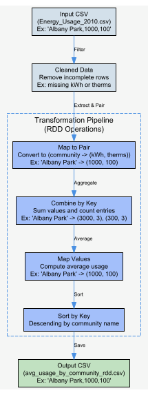
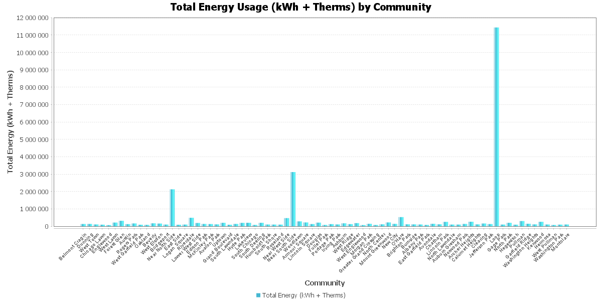
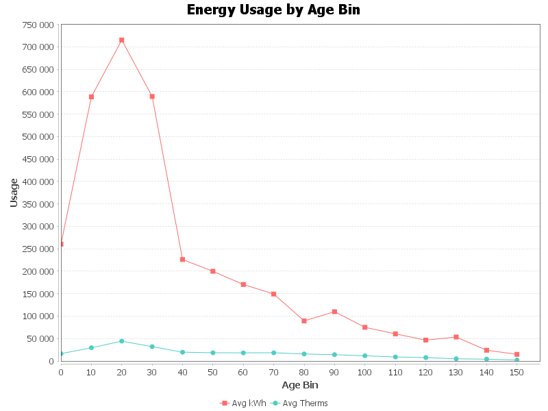
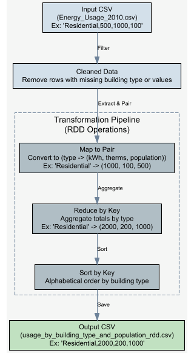
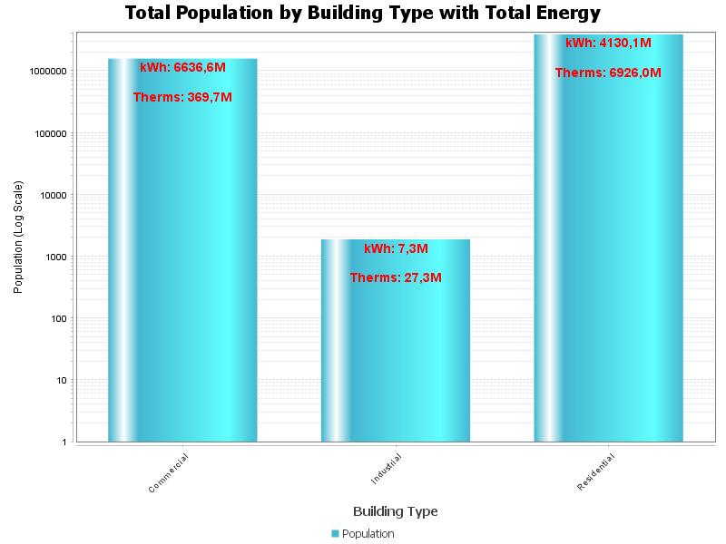

# 🌆 Chicago Energy Usage Analysis (Spark SQL & RDD)

This repository contains a Spark-based Java application to analyze energy usage data for Chicago in 2010. 
The application was initially developed and tested locally using IntelliJ IDEA and Apache Spark.

---

## 📌 Project Description

The project performs statistical analysis on the `Energy_Usage_2010.csv` dataset using both **Spark SQL** and **Spark RDD** APIs, including:

- Average energy consumption by community area
- Correlation between building age and energy usage
- Distribution by building type with population metrics

---

## ⚙️ Prerequisites

### Software Requirements

- **Java Development Kit (JDK):** Version 8 or higher (e.g., OpenJDK 11 or Oracle JDK 11)  
- **Apache Maven:** Version 3.6 or higher  
- **Apache Spark:** Version 2.4 or higher (e.g., 3.2.0), compatible with Scala 2.12  
- **IntelliJ IDEA:** Community or Ultimate edition (version 2021.2 or later)

### Dataset

The `Energy_Usage_2010.csv` file (~30,000 rows , 73 columns). Columns should include:

- COMMUNITY AREA NAME  
- TOTAL KWH  
- TOTAL THERMS  
- BUILDING TYPE  
- AVERAGE BUILDING AGE  

You can download the dataset from the [Chicago Data Portal](https://data.cityofchicago.org) or use the provided sample in `src/main/resources/`.

---

## 🛠️ Installation and Setup

### 1. Install Java Development Kit (JDK)

Download from:

- [Oracle JDK](https://www.oracle.com/java/technologies/javase-downloads.html)  
- [OpenJDK](https://jdk.java.net/)

Set environment variables:

```bash
export JAVA_HOME=/opt/jdk-11
export PATH=$JAVA_HOME/bin:$PATH
```

Verify

```
java -version
```
### 2. Install Apache Maven

Download from [Apache Maven](https://maven.apache.org/download.cgi)

Set environment variables

```bash
export M2_HOME=/opt/maven-3.8.6
export PATH=$M2_HOME/bin:$PATH
```

Verify

```
mvn -version
```

### 3. Install Apache Spark

Download from [Apache Spark](https://spark.apache.org/downloads.html)

Set environment variables

```bash
export SPARK_HOME=/opt/spark-3.2.0
export PATH=$SPARK_HOME/bin:$PATH
```

Verify

```
spark-shell
```

### 4. Set Up IntelliJ IDEA
- Import the project via pom.xml.
- Configure the project SDK to use JDK 11.
- Reimport dependencies and build the project.

### 5. Add the Dataset

- Place Energy_Usage_2010.csv in src/main/resources/.

---

## 🔥 Spark RDD Implementation
The RDD implementation provides low-level control over data processing with these key transformations:

### 1. Average Usage by Community Area (RDD)
#### 🔄 Processing Pipeline
<div align="center">
  
  <br>
  <em>Figure 1.1: Community-Energy RDD Process</em>
</div>

#### 📊 Results Visualization
<div align="center">
  
  <br>
  <strong>Figure 1.2:</strong> Comparative analysis of average electricity (kWh) and gas (therms) consumption across Chicago community areas. Loop shows higher electricity usage.
</div>

### 2. Age-Energy Correlation
#### 🔄 Processing Pipeline
<div align="center">
  
  <br>
  <em>Figure 2.1: Age-Energy RDD Process</em>
</div>

#### 📊 Results Visualization
<div align="center">
  
  <br>
  <strong>Figure 2.2:</strong> Building Age vs. Energy Use: Unexpected Spike in 20–30 Year Cohorts
</div>

### 3. Building Type Analysis
#### 🔄 Processing Pipeline
<div align="center">
  
  <br>
  <em>Figure 3.1: Population & Energy by Building Type RDD Process</em>
</div>

#### 📊 Results Visualization
<div align="center">
  
  <br>
  <strong>Figure 3.2:</strong> Population Doesn’t Equal Power: Commercial Buildings’ Disproportionate Electricity Demand.
</div>

---

## 💼 Contributing

Feel free to fork this repository, submit issues, or create pull requests for improvements such as:

- Adding more analyses
- Supporting cloud deployment
- Improving code modularity
- For issues or feedback, open a GitHub issue or contact [iheb66alimi@gmail.com].


